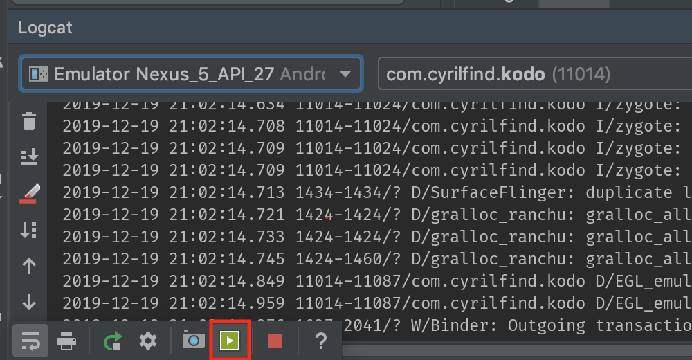

# IIM - Android

**But du cours**: connaître les bases du développement Android et notamment:

- Se familiariser avec Kotlin
- Prendre en main Android Studio et le Layout Editor
- Intéragir avec des `View`
- Implémenter une `RecyclerView`
- Intéroger une API distante

## Déroulement

6 séances avec un minimum de "Cours Magistral" et un maximum de TDs:

- TD 1: Kotlin Koans & Codelabs
- TD 2: RecyclerView
- TD 3: Actions & Intents
- TD 4: Internet
- TD 5: Architecture Components
- TD 6: Images & Permissions
- TD 7: SignUp/Login et Navigation

## Évaluation

L'évaluation se fera sur un rendu de projet par groupe de 2 sous la forme d'une vidéo d'environ 1 minute (facile à faire dans l'émulateur) montrant le fonctionnement de votre app ainsi qu'un lien vers votre projet github (ou un zip)

Cherchez le bouton vert dans le volet "Logcat"

Délai: avant le 4 Janvier au soir

### Barême indicatif

- Note "participation/avancement" en TD:
    - L'app se lance et affiche une liste de tâches / 5
    - Intéraction avec le serveur: / 10
        - Lister
        - Supprimer
        - Ajout simple
    - Architecture MVVM (TD-5) / 5

    - Features en plus: / + 2 pour chaque
        - Ajout Complet
        - Édition
        - Propreté

- Note "autonomie": Avancer sur TD-6 et/ou TD-7 (barême à définir)
